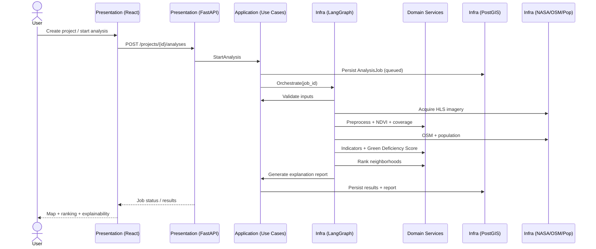
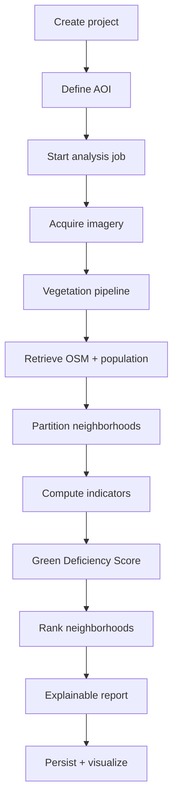

# Analysis sequence

High-level sequence for a full analysis job.

```mermaid
sequenceDiagram
    actor User
    participant UI as Presentation (React)
    participant API as Presentation (FastAPI)
    participant UC as Application (Use Cases)
    participant Agent as Infra (LangGraph)
    participant Dom as Domain Services
    participant DB as Infra (PostGIS)
    participant Ext as Infra (NASA/OSM/Pop)

    User->>UI: Create project / start analysis
    UI->>API: POST /projects/{id}/analyses
    API->>UC: StartAnalysis
    UC->>DB: Persist AnalysisJob (queued)
    UC->>Agent: Orchestrate(job_id)
    Agent->>UC: Validate inputs
    Agent->>Ext: Acquire HLS imagery
    Agent->>Dom: Preprocess + NDVI + coverage
    Agent->>Ext: OSM + population
    Agent->>Dom: Indicators + Green Deficiency Score
    Agent->>Dom: Rank neighborhoods
    Agent->>UC: Generate explanation report
    UC->>DB: Persist results + report
    API-->>UI: Job status / results
    UI-->>User: Map + ranking + explainability
```

## Activity Overview

```mermaid
flowchart TD
    A[Create project] --> B[Define AOI]
    B --> C[Start analysis job]
    C --> D[Acquire imagery]
    D --> E[Vegetation pipeline]
    E --> F[Retrieve OSM + population]
    F --> G[Partition neighborhoods]
    G --> H[Compute indicators]
    H --> I[Green Deficiency Score]
    I --> J[Rank neighborhoods]
    J --> K[Explainable report]
    K --> L[Persist + visualize]
```
