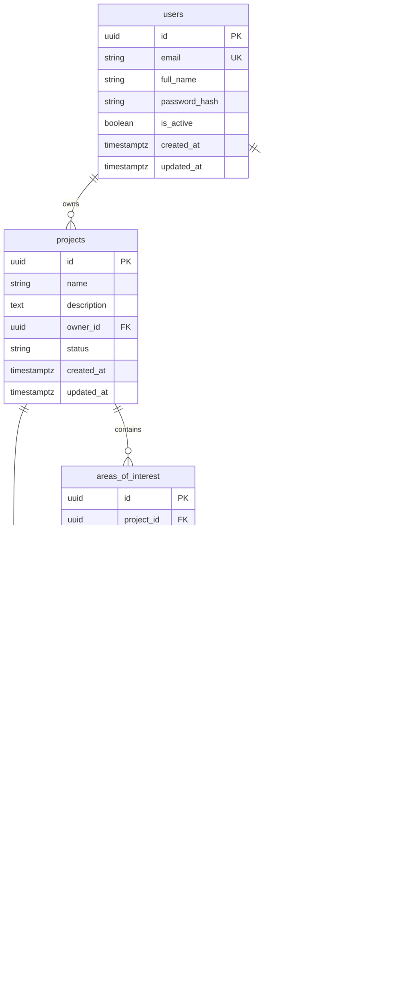

# Entity-relationship diagram

## Notes

- `analysis_jobs.status` ∈ `{queued, running, completed, failed, cancelled}`
- Project delete cascades jobs; AOI/profile deletes are restricted while referenced
